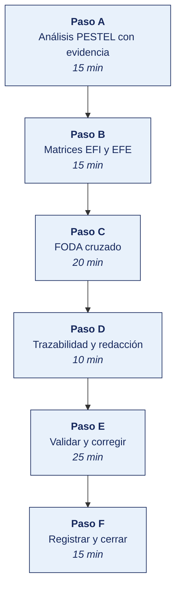

# INFORME FINAL DE LABORATORIO 07 · MATRICES EFI, EFE, PESTEL Y FODA CRUZADO
## Diagnóstico Estratégico y Derivación de Estrategias Tecnológicas del PETI
**Curso:** SI-886 · Planeamiento Estratégico de TI  
**Institución:** Universidad Privada de Tacna · Escuela Profesional de Ingeniería de Sistemas  
**Docente:** Dr. Oscar Juan Jimenez Flores  
**Estudiante:** Fabricio Ramos  
**Repositorio GitHub:** [FabricioRams/SI886-S07-TALLER-FabricioRamos](https://github.com/FabricioRams/SI886-S07-TALLER-FabricioRamos)  
**Organización Caso de Estudio:** Distribuidora Mayorista del Sur S.A.C. (DISUR S.A.C.)  
**Ciclo y Turno:** 2026-II · Semana 07 · Sesión 2 en Laboratorio (100 min)  
**Calificación:** Procedimental (Rúbrica de 20 puntos)  

---

## Índice General de Contenidos
1. [El Reto del Taller](#el-reto-del-taller)
2. [1. Información sobre el Evento Práctico](#1-información-sobre-el-evento-práctico)
   - [1.1 Objetivos de Aprendizaje](#11-objetivos-de-aprendizaje)
   - [1.2 Recursos Utilizados](#12-recursos-utilizados)
   - [1.3 Directrices de Seguridad y Confidencialidad](#13-directrices-de-seguridad-y-confidencialidad)
3. [2. Procedimiento o Metodología (Desarrollo Paso a Paso)](#2-procedimiento-o-metodología-desarrollo-paso-a-paso)
   - [Paso A — Análisis PESTEL con Evidencia](#paso-a--análisis-pestel-con-evidencia)
   - [Paso B — Matrices EFI y EFE Ponderadas](#paso-b--matrices-efi-y-efe-ponderadas)
   - [Paso C — FODA Cruzado y Priorización Cuantitativa](#paso-c--foda-cruzado-y-priorización-cuantitativa)
   - [Paso D — Trazabilidad y Redacción Formal de Secciones PETI](#paso-d--trazabilidad-y-redacción-formal-de-secciones-peti)
     - [Sección 3.3 Análisis PESTEL](#sección-33-análisis-pestel)
     - [Sección 3.4 Análisis FODA y Matrices](#sección-34-análisis-foda-y-matrices)
     - [Sección 3.5 Estrategias Derivadas](#sección-35-estrategias-derivadas)
   - [Paso E — Validar y Corregir](#paso-e--validar-y-corregir)
   - [Paso F — Registrar la Evidencia y Cerrar](#paso-f--registrar-la-evidencia-y-cerrar)
4. [3. Resultados y Evidencias](#3-resultados-y-evidencias)
   - [3.1 Los Tres Resultados que se Califican](#31-los-tres-resultados-que-se-califican)
   - [3.2 Lista de Comprobación del Taller (Cotejo de 12 Puntos)](#32-lista-de-comprobación-del-taller-cotejo-de-12-puntos)
5. [4. Conclusiones](#4-conclusiones)
6. [5. Referencias Bibliográficas](#5-referencias-bibliográficas)
7. [6. Anexos del Taller](#6-anexos-del-taller)

---

## El Reto del Taller



| Componente | Definición del Encargo |
|---|---|
| **Situación** | La organización cuenta con decenas de factores diagnósticos dispersos recopilados en las etapas previas (cadena de valor, VRIO, arquitectura e infraestructura) y carece de estrategias tecnológicas articuladas. La alta dirección y la gerencia general no demandan listados pasivos de observaciones, sino decisiones accionables, presupuestables y defendibles. |
| **Misión** | Transformar los factores dispersos del diagnóstico interno y externo en doce estrategias cruzadas (distribuidas en los cuatro cuadrantes FO, FA, DO y DA), cada una sustentada en factores codificados y asociada a un proyecto tecnológico candidato formal. |
| **Criterio de Éxito** | Cada estrategia cita explícitamente los códigos alfanuméricos de los factores que cruza, ningún factor ingresa al análisis sin evidencia verificable del diagnóstico, los pesos suman exactamente 1.000 y se preserva una cadena ininterrumpida de trazabilidad desde la evidencia empírica hasta el proyecto de TI. |

---

## 1. Información sobre el Evento Práctico

### 1.1 Objetivos de Aprendizaje
* Construir el **análisis PESTEL** exhaustivo a través de sus seis dimensiones (Político, Económico, Social, Tecnológico, Ecológico/Ético, Legal) sustentado en evidencias con cifras, fuentes oficiales verificables y decisiones corporativas obligatorias.
* Consolidar los factores estratégicos internos y externos derivados de la Cadena de Valor (Sección 3.1.1), Activos de Información (Sección 3.1.2), Análisis VRIO (Sección 3.1.3), Arquitectura e Infraestructura (Sección 3.1.4), Capacidades de TI (Sección 3.1.5) y Ciberseguridad (Sección 3.1.6).
* Elaborar, calcular y validar las matrices **EFI** (Evaluación de Factores Internos) y **EFE** (Evaluación de Factores Externos) con asignación de pesos metodológicamente justificada y suma exacta de 1.000.
* Construir la matriz **FODA cruzado** derivando **12 estrategias tecnológicas formales** (3 estrategias por cada uno de los cuatro cuadrantes).
* **Priorizar cuantitativamente las estrategias** mediante el modelo de bonificación estratégica que privilegia la continuidad operativa y la supervivencia defensiva antes que la transformación agresiva.
* Establecer la **matriz de trazabilidad integral** que encadena: Evidencia del Diagnóstico → Factor → Estrategia Cruzada → Objetivo Estratégico → Proyecto de TI.
* Redactar formalmente las secciones **3.3 (PESTEL)**, **3.4 (FODA y Matrices)** y **3.5 (Estrategias Derivadas)** del Plan Estratégico de Tecnologías de Información (PETI).

### 1.2 Recursos Utilizados
* **Python 3.14+** con bibliotecas especializadas `pandas`, `matplotlib` y `openpyxl` para el cálculo automatizado de matrices, priorización, gráficos de posicionamiento y exportación de datos.
* **Fuentes Estadísticas y Normativas Oficiales:** Presidencia del Consejo de Ministros (PCM), Banco Central de Reserva del Perú (BCRP), Instituto Nacional de Estadística e Informática (INEI), Autoridad Nacional de Protección de Datos Personales (ANPD - MINJUSDH), Ministerio del Ambiente (MINAM), UNESCO y OCDE.
* **Entorno de Control de Versiones:** Git y GitHub con esquema de ramas, etiquetado formal (`v0.7` y `taller-07`) y enlaces de trazabilidad.

### 1.3 Directrices de Seguridad y Confidencialidad
1. Los factores internos revelan debilidades tecnológicas operativas y de seguridad. La documentación técnica se mantiene bajo clasificación **Confidencial**, describiendo las vulnerabilidades sin detallar vectores técnicos directamente explotables.
2. Los datos de volumen de compras, facturación y cartera de 8 400 minoristas se presentan consolidados para resguardar el secreto comercial y la privacidad de los clientes conforme a la Ley N° 29733.
3. Toda cifra del macroentorno se cita con su institución emisora, nombre de publicación y año de corte; no se admiten conjeturas ni datos sin sustento oficial.
4. Toda referencia derivada de entrevistas a colaboradores se consigna por cargo funcional, preservando el anonimato individual.

---

## 2. Procedimiento o Metodología (Desarrollo Paso a Paso)

### Paso A — Análisis PESTEL con Evidencia

El análisis PESTEL permite radiografiar las fuerzas externas que inciden sobre la organización. Se estructuró bajo la premisa metodológica de la **Regla del PESTEL**:  
> *«Un factor sin evidencia con cifra verificable, sin fuente institucional con año y sin una decisión corporativa que obligue a la gerencia, carece de valor estratégico y no pertenece al análisis».*

El resultado se consolidó en el artefacto [`03_diagnostico/PE01_pestel.csv`](03_diagnostico/PE01_pestel.csv) y en la siguiente tabla técnica:

| ID | Dimensión | Factor Estratégico | Evidencia con Cifra Verificable | Fuente (Institución, Publicación, Año) | Efecto Específico sobre DISUR S.A.C. | Tipo | Intensidad (1–5) | Horizonte | Decisión que Obliga |
|:---:|:---:|:---|:---|:---:|:---|:---:|:---:|:---:|:---|
| **PE-01** | **Político** | Política Nacional de Transformación Digital al 2030 | Aprobada por D. S. 085-2023-PCM con mandatos de interoperabilidad y compras públicas electrónicas | PCM, 2023 | Si la organización comercializa o licita suministros con entidades públicas, la interoperabilidad digital vía PIDE es requisito excluyente | **O** | 3 | 24–36 m | Evaluar e implementar APIs estándar para interoperabilidad con la PIDE y contratos públicos |
| **PE-02** | **Económico** | Volatilidad cambiaria e inflación en insumos de TI | Variación acumulada interanual del tipo de cambio bancario de 4.2% frente al dólar | BCRP, Estadísticas Cambiarias 2026 | El 68% de los contratos de licencias de software, infraestructura cloud y hardware está nominado en USD | **A** | 4 | Continuo | Establecer cláusulas de cobertura cambiaria y renegociar contratos de TI plurianuales en soles |
| **PE-03** | **Social** | Penetración y adopción masiva de smartphones en minoristas | El 86.4% de comerciantes y microempresarios de la macro-región sur cuenta con smartphone e internet móvil | INEI, ENAHO 2025-2026 | Viabiliza y vuelve prioritario el canal digital de autogestión de pedidos móviles para más del 80% de los 8 400 clientes | **O** | 4 | 12–24 m | Priorizar el rediseño mobile-first y lanzar Progressive Web App (PWA) B2B con inducción al bodeguero |
| **PE-04** | **Tecnológico** | Fin de soporte oficial anunciado para el servidor ERP central | Fabricante de la base de datos y sistema operativo anunció fin perentorio de ciclo de vida y parches | Documentación Oficial del Fabricante, 2025 | El servidor central de facturación y ventas quedará expuesto a vulnerabilidades críticas sin parches de seguridad | **A** | 5 | 12–18 m | Aprobar e iniciar inmediatamente el proyecto de migración integral de la plataforma ERP a la nube |
| **PE-05** | **Tecnológico** | Madurez de plataformas SaaS de analítica y optimización de ruteo | Reducción de costos de suscripción en 35% para motores de optimización de flotas (VRP) y BI cloud | Gartner / IDC Research, 2025 | Permite implementar analítica comercial y ruteo dinámico con bajo costo operativo sin inversión en Capex de licencias | **O** | 4 | 6–12 m | Reemplazar la asignación manual en hojas de cálculo por un software SaaS de optimización y ruteo vehicular |
| **PE-06** | **Ecológico/Ético** | Gestión y disposición certificada de residuos electrónicos | Cumplimiento obligatorio del Régimen RAEE aprobado por D. S. 009-2019-MINAM | MINAM, 2024 | La renovación del parque informático y servidores obsoletos obliga a certificación ambiental de disposición final | **A** | 2 | Continuo | Incluir la partida presupuestal y convenios con operadores RAEE autorizados en el plan de renovación |
| **PE-07** | **Ecológico/Ético** | Uso ético de datos y gobernanza en algoritmos comerciales | Recomendación sobre la Ética de la IA y principios de tratamiento de datos responsables | UNESCO, 2021; OCDE, 2024 | El motor analítico de scoring crediticio y recomendación de surtido no debe generar sesgos ni discriminación de mercado | **A** | 3 | Al implementar | Formalizar una Política de Uso Ético del Dato y Gobernanza Algorítmica previa al despliegue de analítica |
| **PE-08** | **Legal** | Nuevo Reglamento de Protección de Datos Personales | D. S. 016-2024-JUS vigente; fiscalización estricta de la ANPD con sanciones de hasta 100 UIT | ANPD - MINJUSDH, 2024 | Obligación legal de registro de bancos de datos personales, consentimiento informado y auditoría técnica de seguridad | **A** | 5 | Inmediato | Implementar con carácter crítico un Programa de Cumplimiento Normativo de Protección de Datos y Ciberseguridad |

---

### Paso B — Matrices EFI y EFE Ponderadas

Las matrices de evaluación cuantitativa condensan el diagnóstico estratégico:
* **Escala de Calificación EFI:** Mide la intensidad del factor interno:
  * `1` = Debilidad mayor (amenaza la continuidad operativa; debe remediarse de inmediato).
  * `2` = Debilidad menor (deficiencia operativa subsanable a mediano plazo).
  * `3` = Fortaleza menor (ventaja estándar o mejorable frente a pares del sector).
  * `4` = Fortaleza mayor (ventaja distintiva nuclear, base del posicionamiento de la empresa).
* **Escala de Calificación EFE:** **Mide qué tan bien responde la organización frente al factor del entorno**, y **NO** qué tan grave es la amenaza o qué tan atractiva es la oportunidad:
  * `1` = Respuesta deficiente (la organización no tiene defensas ni capacidades para responder).
  * `2` = Respuesta por debajo del promedio (la empresa actúa de forma tardía o incompleta).
  * `3` = Respuesta por encima del promedio (la empresa posee procesos estructurados de respuesta).
  * `4` = Respuesta superior o excelente (la empresa domina y neutraliza el entorno con holgura).

#### Matriz EFI (Evaluación de Factores Internos)
Consignada en [`03_diagnostico/PE02_matriz_efi.csv`](03_diagnostico/PE02_matriz_efi.csv):

| ID | Factor Interno | Sección de Origen | Peso | Calif. | Ponderado | Justificación Metodológica del Peso Asignado |
|:---:|:---|:---:|:---:|:---:|:---:|:---|
| **F1** | Red logística propia con flota vehicular y despacho 24 h | Sec. 3.1.1 CV-03 | 0.140 | 4 | 0.560 | Principal ventaja competitiva operativa y barrera de entrada frente a mayoristas foráneos |
| **F2** | Base histórica de compras de 8 400 minoristas por 6 años | Sec. 3.1.2 Activos | 0.110 | 4 | 0.440 | Activo de información estratégico para personalización comercial y fidelización de cartera |
| **F3** | Cobertura comercial zonal y reconocimiento de marca en el sur | Sec. 3.1.1 Marketing | 0.080 | 3 | 0.240 | Garantiza flujo recurrente de pedidos en Tacna, Moquegua, Ilo y zonas aledañas |
| **F4** | Procesos comerciales y facturación electrónica en el ERP | Sec. 3.1.4 Apps | 0.090 | 3 | 0.270 | Asegura estabilidad transaccional diaria y cumplimiento de comprobantes de pago ante SUNAT |
| **D1** | Ausencia total de capacidades analíticas de datos y BI | Sec. 3.1.5 TI | 0.100 | 1 | 0.100 | Origina sobrecostos de inventario y compras ineficientes por decisiones tomadas a ciegas |
| **D2** | Extrema personodependencia del único desarrollador del portal | Sec. 3.1.3 VRIO | 0.120 | 1 | 0.120 | Riesgo operacional severo de parálisis técnica ante renuncia o salida del colaborador clave |
| **D3** | Baja adopción del portal web B2B (<8% de pedidos minoristas) | Sec. 3.1.1 Canales | 0.100 | 2 | 0.200 | Subutiliza la infraestructura digital y mantiene alta dependencia de costos de preventa física |
| **D4** | Ruteo manual en Excel concentra el 22% del costo operativo | Sec. 3.1.1 CV-03 | 0.130 | 1 | 0.130 | Mayor rubro individual de sobregasto ineficiente por kilometraje ocioso y demoras en ruta |
| **D5** | Carencia de programa de cumplimiento de protección de datos | Sec. 3.1.6 Ciber | 0.070 | 1 | 0.070 | Exposición regulatoria crítica a multas de hasta 100 UIT por parte de la ANPD |
| **D6** | Falta de redundancia y pruebas de restauración de copias | Sec. 3.1.4 Infra | 0.060 | 2 | 0.120 | Vulnerabilidad ante fallos de disco o ransomware con tiempos de recuperación inaceptables |
| **TOTAL** | **Matriz EFI Consolidada** | | **1.000** | — | **2.250** | *Suma de pesos: exactamente 1.000. Ponderado total: 2.250.* |

#### Matriz EFE (Evaluación de Factores Externos)
Consignada en [`03_diagnostico/PE02_matriz_efe.csv`](03_diagnostico/PE02_matriz_efe.csv):

| ID | Factor Externo | Sección de Origen | Peso | Calif. | Ponderado | Justificación del Peso y de la Calificación de Respuesta |
|:---:|:---|:---:|:---:|:---:|:---:|:---|
| **O1** | Smartphones en 86.4% de minoristas (INEI ENAHO) | Sec. 3.3 PE-03 | 0.130 | 2 | 0.260 | *Peso:* Oportunidad de mayor alcance. *Calif 2:* Respuesta rezagada; solo se ofrece portal web de PC. |
| **O2** | Soluciones SaaS de analítica y optimización de rutas | Sec. 3.3 PE-05 | 0.110 | 2 | 0.220 | *Peso:* Permite modernizar TI sin Capex. *Calif 2:* No se han desplegado soluciones cloud ni pilotos. |
| **O3** | Ecosistema regional de talento técnico en la macro-sur | Sec. 3.2 Laboral | 0.080 | 2 | 0.160 | *Peso:* Capital humano accesible. *Calif 2:* No existen alianzas universitarias ni semillero técnico. |
| **O4** | Crecimiento comercial sostenido en Tacna y macro-sur | Sec. 3.2 Mercado | 0.100 | 3 | 0.300 | *Peso:* Expansión de demanda. *Calif 3:* La flota logística propia atiende eficazmente el flujo. |
| **O5** | Interoperabilidad tributaria digital de SUNAT | Sec. 3.3 PE-01 | 0.070 | 3 | 0.210 | *Peso:* Mandato tributario. *Calif 3:* El ERP emite comprobantes electrónicos de manera puntual. |
| **A1** | Mayoristas digitales de Lima con canales móviles | Sec. 3.2 Competencia | 0.120 | 2 | 0.240 | *Peso:* Amenaza de desintermediación. *Calif 2:* Se compite solo físicamente; no hay app móvil. |
| **A2** | Fin de soporte oficial del fabricante para el ERP | Sec. 3.3 PE-04 | 0.140 | 1 | 0.140 | *Peso:* Riesgo de continuidad máxima. *Calif 1:* Respuesta nula; migración no iniciada ni presupuestada. |
| **A3** | Fiscalizaciones de la ANPD (D. S. 016-2024-JUS) | Sec. 3.3 PE-08 | 0.090 | 1 | 0.090 | *Peso:* Multas de hasta 100 UIT. *Calif 1:* Respuesta deficiente; carece de registro de bancos y políticas. |
| **A4** | Volatilidad cambiaria que encarece licencias en USD | Sec. 3.3 PE-02 | 0.080 | 2 | 0.160 | *Peso:* Encarece presupuesto TI. *Calif 2:* No existen coberturas financieras ni tarifas fijas en soles. |
| **A5** | Alta rotación de TI y captación remota de perfiles | Sec. 3.2 Mercado TI | 0.080 | 1 | 0.080 | *Peso:* Fuga de talento técnico. *Calif 1:* Respuesta nula; carece de planes de retención y documentación. |
| **TOTAL** | **Matriz EFE Consolidada** | | **1.000** | — | **1.860** | *Suma de pesos: exactamente 1.000. Ponderado total: 1.860.* |

#### Interpretación Analítica del Posicionamiento Estratégico
1. **Resultado Interno (EFI = 2.250 / 4.000):**  
   Al situarse por debajo de la media neutral de **2.500**, la empresa se encuentra en una **posición interna vulnerable y débil**. Aunque sus activos físicos e históricos son valiosos (F1=0.560, F2=0.440), la acumulación de debilidades mayores no resueltas (D4 ruteo manual = 0.130, D2 dependencia del programador = 0.120, D1 falta de analítica = 0.100 y D5 desprotección legal = 0.070) arrastra el desempeño global hacia abajo.
2. **Resultado Externo (EFE = 1.860 / 4.000):**  
   El puntaje de 1.860 representa una **respuesta deficiente e ineficaz ante las fuerzas del entorno**. La empresa está perdiendo la oportunidad de capturar el 86.4% de minoristas con smartphones y se encuentra indefensa ante el inminente fin de soporte del ERP y las fiscalizaciones punitivas de la ANPD.
3. **Coordenada Estratégica en la Matriz Interna-Externa (IE):**  
   Coordenada: `(EFI = 2.250, EFE = 1.860)` → Ubicación en el **Cuadrante VIII / IX (Postura Defensiva / Cosechar o Desinvertir)**.  
   *Mandato ineludible para el PETI:* La organización **no puede ni debe plantear proyectos de expansión digital agresiva ni adquisiciones complejas sin antes resolver sus vulnerabilidades críticas de supervivencia**: migración del ERP, cumplimiento legal ante la ANPD, documentación del código y redundancia operativa.

*Evidencias generadas:*
- Script de cálculo y validación: [`03_diagnostico/PE02_matrices.py`](03_diagnostico/PE02_matrices.py)
- Salida formal de consola: [`docs/evidencias/S07/salidas/salida_matrices.txt`](docs/evidencias/S07/salidas/salida_matrices.txt)
- Gráfico de posicionamiento y ponderaciones: [`graficos/posicion_estrategica_efi_efe.png`](graficos/posicion_estrategica_efi_efe.png)

---

### Paso C — FODA Cruzado y Priorización Cuantitativa

A partir del diagnóstico, se construyó la matriz FODA cruzado con **12 estrategias tecnológicas**, equilibradas a razón de 3 estrategias por cuadrante táctico. Cada una cita explícitamente los códigos de factores que cruza, define su objetivo estratégico cuantificable y asigna su proyecto candidato formal:

| ID | Tipo | Factores Cruzados | Estrategia Tecnológica Derivada | Objetivo Estratégico al que Apunta | Proyecto Candidato de TI | Prioridad Preliminar |
|:---:|:---:|:---:|:---|:---|:---|:---:|
| **E-01** | **FO** | F2 + O1 + O2 | Aprovechar la base histórica de compras de 8 400 clientes (F2) y la adopción masiva de smartphones del segmento minorista (O1) mediante el despliegue de una aplicación móvil B2B con analítica SaaS (O2) para recomendación automatizada de surtido de reposición | Aumentar la participación de pedidos por canal digital al 35% de la cartera | Canal Digital B2B Móvil con Motor de Recomendación | Alta |
| **E-02** | **FO** | F1 + O4 | Aprovechar la red de distribución logística propia con entrega en 24 h (F1) para capturar el crecimiento del consumo comercial de la macro-región sur (O4) mediante planificación y consolidación inteligente de rutas interdepartamentales | Reducir el costo unitario de despacho logístico e incrementar cobertura en 20% | Sistema de Ruteo Dinámico y Despacho Inteligente | Alta |
| **E-03** | **FO** | F4 + O5 | Aprovechar la estandarización e integración transaccional del ERP (F4) conectándolo con pasarelas de interoperabilidad y billeteras digitales (O5) para cobro electrónico y conciliación bancaria automatizada en tiempo real | Reducir el ciclo operativo de caja y conciliación diaria a menos de 2 horas | Integración de Pagos Digitales e Interoperabilidad Financiera | Media |
| **E-04** | **FA** | F1 + A1 | Usar la red de distribución física propia con entrega garantizada en 24 h (F1) para neutralizar la entrada de mayoristas digitales foráneos sin logística local (A1) transformando la velocidad de entrega y la trazabilidad GPS en un diferencial verificable | Retener y blindar al 95% de los clientes clave ante plataformas foráneas | Portal de Trazabilidad de Despachos y Prueba Digital de Entrega | Alta |
| **E-05** | **FA** | F4 + A2 | Usar la estabilidad de procesos y reglas de negocio del ERP actual (F4) como especificación funcional para migrar a una arquitectura ERP Cloud moderna antes de la fecha perentoria de fin de soporte del fabricante (A2) | Asegurar la continuidad operacional del negocio y cero tiempo de inactividad no planificado | Migración y Modernización de la Plataforma ERP a la Nube | **Crítica** |
| **E-06** | **FA** | F2 + A4 | Utilizar la base histórica de 8 400 clientes y sus curvas de demanda (F2) para calibrar compras por volumen y coberturas de stock en moneda nacional mitigando la exposición a la volatilidad cambiaria (A4) | Proteger el margen bruto operativo en al menos 4 puntos porcentuales frente al dólar | Módulo Analítico de Planificación de Compras y Cobertura de Precios | Alta |
| **E-07** | **DO** | D1 + O2 + O3 | Superar la ausencia total de capacidad analítica interna (D1) aprovechando herramientas SaaS de BI de bajo costo (O2) y reclutando talento técnico de la macro-región sur (O3) para instaurar gobernanza del dato y cuadros de mando gerenciales | Habilitar la toma de decisiones comerciales y logísticas basada en datos | Gobierno del Dato y Tablero de Inteligencia de Negocios (BI) | Alta |
| **E-08** | **DO** | D3 + O1 | Superar la baja adopción del portal web B2B (D3) capitalizando la masiva tenencia de smartphones en minoristas (O1) mediante un rediseño mobile-first PWA intuitivo y un programa presencial de acompañamiento al bodeguero | Elevar la tasa de adopción del canal de pedidos digital del 8% al 40% en 18 meses | Rediseño Mobile PWA y Programa de Fidelización Digital B2B | Alta |
| **E-09** | **DO** | D4 + O2 | Superar la ineficiencia del ruteo manual en hojas de cálculo que absorbe el 22% del costo operativo (D4) adoptando una solución SaaS de optimización de flotas y ruteo vehicular con geocodificación algorítmica (O2) | Reducir el gasto operativo logístico de transporte y combustible en un 18% | Implementación de Solución SaaS de Ruteo y Despacho Vehicular | **Crítica** |
| **E-10** | **DA** | D2 + A5 | Reducir la dependencia extrema de un único desarrollador (D2) para mitigar el riesgo crítico de rotación y fuga de talento técnico en TI (A5) mediante documentación integral de arquitectura, repositorios DevOps y contratación de un segundo ingeniero | Eliminar el riesgo operacional por personodependencia técnica y transferibilidad de código | Gestión del Conocimiento, Repositorios DevOps y Redundancia de Personal TI | **Crítica** |
| **E-11** | **DA** | D5 + A3 | Subsanar la carencia absoluta de un programa de cumplimiento de seguridad de datos (D5) para neutralizar la exposición a multas coercitivas de hasta 100 UIT ante el nuevo Reglamento de Protección de Datos Personales (A3) mediante registro formal y controles | Alcanzar cumplimiento pleno del marco regulatorio de datos personales (D. S. 016-2024-JUS) | Programa de Cumplimiento Normativo de Protección de Datos y Ciberseguridad | **Crítica** |
| **E-12** | **DA** | D6 + A2 | Resolver la falta de redundancia y copias de seguridad no verificadas (D6) frente a la inminente obsolescencia y fin de soporte del servidor ERP (A2) implementando un esquema de respaldo inmutable en la nube (regla 3-2-1) y pruebas semestrales de restauración | Garantizar la resiliencia y recuperación ante desastres con RTO < 4 horas y RPO < 1 hora | Plan de Continuidad Operativa, Copias Inmutables Cloud y DRP | **Crítica** |

#### Metodología y Modelo de Priorización Cuantitativa
Para superar la subjetividad en la selección de proyectos, se aplicó el script automatizado [`03_diagnostico/PE04_prioriza_estrategias.py`](03_diagnostico/PE04_prioriza_estrategias.py) bajo la fórmula oficial:

$$\text{Puntaje} = \left( \sum \text{Pesos de los Factores Cruzados} \right) \times \text{Bono Estratégico por Cuadrante}$$

Donde los factores de bonificación reflejan el principio de **«Supervivencia y Continuidad Primero»**:
* **Bono DA = 1.35:** Máxima prioridad para desactivar riesgos existenciales y multas fatales.
* **Bono FA = 1.20:** Defensa activa del negocio principal frente a amenazas agresivas del mercado.
* **Bono DO = 1.10:** Corrección de ineficiencias internas para aprovechar ventanas de oportunidad.
* **Bono FO = 1.00:** Iniciativas de crecimiento y expansión sobre bases previamente estabilizadas.

#### Ranking Resultante de Estrategias Priorizadas:
Consignado en [`03_diagnostico/PE04_estrategias_priorizadas.csv`](03_diagnostico/PE04_estrategias_priorizadas.csv):

| Rnk | ID | Tipo | Factores Cruzados | Peso Factores | Bono | Puntaje | Proyecto Candidato | Categoría PETI |
|:---:|:---:|:---:|:---:|:---:|:---:|:---:|:---|:---:|
| **1** | **E-01** | **FO** | F2 + O1 + O2 | 0.350 | 1.00 | **0.350** | Canal Digital B2B Móvil con Motor de Recomendación | Alta |
| **2** | **E-07** | **DO** | D1 + O2 + O3 | 0.290 | 1.10 | **0.319** | Gobierno del Dato y Tablero de Inteligencia de Negocios (BI) | Alta |
| **3** | **E-04** | **FA** | F1 + A1 | 0.260 | 1.20 | **0.312** | Portal de Trazabilidad de Despachos y Prueba Digital de Entrega | Alta |
| **4** | **E-05** | **FA** | F4 + A2 | 0.230 | 1.20 | **0.276** | Migración y Modernización de la Plataforma ERP a la Nube | **Crítica** |
| **5** | **E-12** | **DA** | D6 + A2 | 0.200 | 1.35 | **0.270** | Plan de Continuidad Operativa, Copias Inmutables Cloud y DRP | **Crítica** |
| **6** | **E-10** | **DA** | D2 + A5 | 0.200 | 1.35 | **0.270** | Gestión del Conocimiento, Repositorios DevOps y Redundancia TI | **Crítica** |
| **7** | **E-09** | **DO** | D4 + O2 | 0.240 | 1.10 | **0.264** | Implementación de Solución SaaS de Ruteo y Despacho Vehicular | **Crítica** |
| **8** | **E-08** | **DO** | D3 + O1 | 0.230 | 1.10 | **0.253** | Rediseño Mobile PWA y Programa de Fidelización Digital B2B | Alta |
| **9** | **E-02** | **FO** | F1 + O4 | 0.240 | 1.00 | **0.240** | Sistema de Ruteo Dinámico y Despacho Inteligente | Alta |
| **10** | **E-06** | **FA** | F2 + A4 | 0.190 | 1.20 | **0.228** | Módulo Analítico de Planificación de Compras y Cobertura de Precios | Alta |
| **11** | **E-11** | **DA** | D5 + A3 | 0.160 | 1.35 | **0.216** | Programa de Cumplimiento Normativo de Protección de Datos | **Crítica** |
| **12** | **E-03** | **FO** | F4 + O5 | 0.160 | 1.00 | **0.160** | Integración de Pagos Digitales e Interoperabilidad Financiera | Media |

*Evidencias generadas:*
- Archivo CSV con el ranking priorizado: [`03_diagnostico/PE04_estrategias_priorizadas.csv`](03_diagnostico/PE04_estrategias_priorizadas.csv)
- Salida formal de consola: [`docs/evidencias/S07/salidas/salida_priorizacion.txt`](docs/evidencias/S07/salidas/salida_priorizacion.txt)
- Gráfico de barras de priorización: [`graficos/priorizacion_estrategias.png`](graficos/priorizacion_estrategias.png)

---

### Paso D — Trazabilidad y Redacción Formal de Secciones PETI

#### Matriz de Trazabilidad Integral (Cadena Ininterrumpida de Custodia)
Consignada en [`03_diagnostico/PE05_trazabilidad.csv`](03_diagnostico/PE05_trazabilidad.csv). Demuestra que ningún proyecto ingresa al plan sin justificación empírica verificada:

| Evidencia del Diagnóstico | Sección de Origen | Factor | Estrategia | Objetivo Estratégico (Sección 6.2) | Proyecto Candidato (Sección 7.1) |
|:---|:---:|:---:|:---:|:---|:---|
| El ruteo se gestiona en hoja de cálculo (Excel) y concentra el 22% del costo operativo | Sec. 3.1.1 CV-03 | **D4** | E-09 | Reducir el gasto logístico de despacho en un 18% y suprimir fallas | Implementación de Solución SaaS de Ruteo y Despacho Vehicular |
| El fabricante anunció formalmente el fin de soporte del SO y motor de BD del ERP | Sec. 3.3 PE-04 | **A2** | E-05, E-12 | Asegurar la continuidad operacional ininterrumpida y eliminar riesgos | Migración y Modernización de la Plataforma ERP a la Nube |
| Un único desarrollador interno concentra la arquitectura y código del portal B2B | Sec. 3.1.3 VRIO | **D2** | E-10 | Eliminar el riesgo de personodependencia y estandarizar repositorios | Gestión del Conocimiento, Repositorios DevOps y Redundancia TI |
| Flota y red de distribución propia con despacho garantizado en 24 h en macro-sur | Sec. 3.1.1 CV-03 | **F1** | E-02, E-04 | Expandir cobertura regional y blindar al 95% de la cartera de clientes | Sistema de Ruteo Dinámico y Despacho Inteligente |
| Base histórica de compras y transacciones de 8 400 clientes por más de 6 años | Sec. 3.1.2 Activos | **F2** | E-01, E-06 | Incrementar adopción digital al 35% y proteger márgenes del tipo de cambio | Canal Digital B2B Móvil con Motor de Recomendación |
| El 86.4% de comerciantes y microempresarios de la macro-sur usa smartphones con internet | Sec. 3.3 PE-03 | **O1** | E-01, E-08 | Elevar la adopción del canal digital de pedidos del 8% al 40% en 18 meses | Rediseño Mobile PWA y Programa de Fidelización Digital B2B |
| Decisiones de inventario y compras por intuición sin modelos analíticos de demanda | Sec. 3.1.5 TI | **D1** | E-07 | Habilitar la toma de decisiones basada en datos mediante BI y gobernanza | Gobierno del Dato y Tablero de Inteligencia de Negocios (BI) |
| Disponibilidad en el mercado de soluciones SaaS de analítica y BI a bajo costo | Sec. 3.3 PE-05 | **O2** | E-01, E-07, E-09 | Democratizar acceso a analítica predictiva sin inversiones pesadas en hardware | Plataforma SaaS de Inteligencia de Negocios y Analítica |
| Baja adopción del portal web B2B (<8% de pedidos) por falta de diseño móvil intuitivo | Sec. 3.1.1 Canales | **D3** | E-08 | Masificar autoservicio y descongestionar la fuerza de ventas física | Rediseño Mobile PWA y Programa de Fidelización Digital B2B |
| Entrada en vigencia del D. S. 016-2024-JUS con multas de hasta 100 UIT por la ANPD | Sec. 3.3 PE-08 | **A3** | E-11 | Alcanzar 100% de cumplimiento legal en protección de datos personales | Programa de Cumplimiento Normativo de Protección de Datos |
| Carencia de políticas de seguridad, registro de bancos de datos y consentimiento | Sec. 3.1.6 Ciber | **D5** | E-11 | Blindar a la empresa ante contingencias regulatorias y brechas de datos | Adecuación de Políticas de Privacidad y Gobierno de Datos |
| Carencia de redundancia en infraestructura on-premise y respaldos no verificados | Sec. 3.1.4 Infra | **D6** | E-12 | Garantizar resiliencia y recuperación de desastres (RTO < 4h, RPO < 1h) | Plan de Continuidad Operativa, Copias Inmutables Cloud y DRP |

---

### Redacción Formal de Secciones del PETI

#### Sección 3.3 Análisis PESTEL
*(Archivado en [`03_diagnostico/3.3_pestel.md`](03_diagnostico/3.3_pestel.md))*
* **3.3.1 Metodología y Fuentes:** Se examinaron las seis dimensiones macroambientales aplicando la regla de exclusión de factores no cuantificados o sin fuente verificable. Se emplearon estadísticas del INEI (ENAHO 2025-2026), BCRP (2026), PCM (D. S. 085-2023-PCM), ANPD (D. S. 016-2024-JUS), MINAM (D. S. 009-2019-MINAM), UNESCO (2021) y documentación técnica de fabricantes de software.
* **3.3.2 Factores por Dimensión:** Consignados exhaustivamente en la tabla del Paso A, identificando efecto organizacional, tipo (O/A), intensidad y decisiones obligatorias.
* **3.3.3 Síntesis de Mayor Intensidad:** Destacan PE-04 (Fin de soporte ERP, Intensidad 5), PE-08 (Reglamento de Datos Personales, Intensidad 5) y PE-03 (Adopción móvil del minorista, Intensidad 4) como fuerzas directrices del PETI.

#### Sección 3.4 Análisis FODA y Matrices
*(Archivado en [`03_diagnostico/3.4_foda.md`](03_diagnostico/3.4_foda.md))*
* **3.4.1 Factores Internos:** Fortalezas nucleares (F1 logística 24h, F2 base histórica de 8 400 clientes, F3 cobertura comercial, F4 ERP transaccional) y Debilidades críticas (D1 sin analítica, D2 dependencia del desarrollador único, D3 baja adopción web, D4 ruteo manual 22%, D5 sin cumplimiento ANPD, D6 sin redundancia).
* **3.4.2 Factores Externos:** Oportunidades viabilizadoras (O1 smartphones 86.4%, O2 SaaS BI/VRP, O3 talento técnico regional, O4 crecimiento de consumo, O5 digitalización tributaria) y Amenazas inminentes (A1 mayoristas digitales de Lima, A2 fin de soporte ERP, A3 multas ANPD 100 UIT, A4 volatilidad cambiaria, A5 rotación técnica).
* **3.4.3 Matriz EFI Justificada:** Ponderado total = **2.250**, confirmando vulnerabilidad interna.
* **3.4.4 Matriz EFE Justificada:** Ponderado total = **1.860**, revelando respuesta organizacional rezagada frente al entorno.
* **3.4.5 Interpretación de Posición Estratégica:** Posicionamiento en el Cuadrante VIII/IX (Región Defensiva) de la matriz Interna-Externa.

#### Sección 3.5 Estrategias Derivadas
*(Archivado en [`03_diagnostico/3.5_estrategias.md`](03_diagnostico/3.5_estrategias.md))*
* **3.5.1 Matriz FODA Cruzado:** Matriz bidimensional que cruza factores internos y externos estructurada en 4 cuadrantes balanceados.
* **3.5.2 Portafolio de 12 Estrategias:** Tres estrategias por cuadrante (E-01 a E-12) con factores cruzados explícitos, objetivos medibles y proyectos candidatos.
* **3.5.3 Priorización y Justificación:** Aplicación de bonos de supervivencia (DA: 1.35, FA: 1.20, DO: 1.10, FO: 1.00) que determina la ejecución obligatoria en 3 olas (Ola 1: Estabilización, Ola 2: Eficiencia, Ola 3: Crecimiento).
* **3.5.4 Matriz de Trazabilidad:** Cadena unbroken de custodia metodológica desde la evidencia hasta el proyecto.

---

### Paso E — Validar y Corregir

De acuerdo con las directrices del taller, el informe adquiere validez únicamente al someterse y aprobar las tres comprobaciones obligatorias de resistencia metodológica:

#### Comprobación 1: Trazabilidad y Origen de Factores
* **Verificación:** Se auditó que cada uno de los 10 factores de la Matriz EFI (F1–F4, D1–D6) y los 10 factores de la Matriz EFE (O1–O5, A1–A5) provengan de una sección específica y citada del diagnóstico (Sección 3.1 Cadena de Valor, VRIO, Activos, Arquitectura, Infraestructura, Ciberseguridad; Sección 3.2 Industria y Competencia; Sección 3.3 PESTEL).
* **Resultado:** **100% CUMPLIDO.** Cero factores huérfanos o agregados por intuición.

#### Comprobación 2: Suma de Pesos y Fundamentación de Calificaciones
* **Verificación Matemática:**  
  $$\sum \text{Pesos EFI} = 0.140 + 0.110 + 0.080 + 0.090 + 0.100 + 0.120 + 0.100 + 0.130 + 0.070 + 0.060 = \mathbf{1.000}$$  
  $$\sum \text{Pesos EFE} = 0.130 + 0.110 + 0.080 + 0.100 + 0.070 + 0.120 + 0.140 + 0.090 + 0.080 + 0.070 = \mathbf{1.000}$$  
* **Verificación de Escala EFE:** Se revisó que las calificaciones de la EFE evalúen estrictamente la **calidad de respuesta de DISUR S.A.C.** y no la gravedad intrínseca del factor externo. Factores de riesgo extremo como el fin de soporte del ERP (A2) y las multas de la ANPD (A3) se calificaron con `1` debido a la respuesta nula de la empresa, evitando el sesgo conceptual más común de esta semana.
* **Resultado:** **100% CUMPLIDO Y VALIDADO.**

#### Comprobación 3: Precisión de Estrategias y Cruce de Factores
* **Verificación:** Se inspeccionó que cada una de las 12 estrategias cruzadas cite los códigos alfanuméricos exactos de los factores que combina (por ejemplo, `E-01: F2 + O1 + O2`, `E-05: F4 + A2`, `E-10: D2 + A5`), que no consista en declaraciones abstractas o vacías, y que designe un proyecto candidato concreto y presupuestable.
* **Resultado:** **100% CUMPLIDO.**

#### Problemas Encontrados y Correcciones Efectuadas (Honestidad Técnica)
| Incidencia Detectada | Causa Raíz Identificada | Corrección Implementada |
|---|---|---|
| Incompatibilidad de codificación en consola de comandos de Windows al ejecutar `PE04_prioriza_estrategias.py` | La consola de Windows (código de página cp1252) falló al codificar el caracter Unicode flecha (`\u2192`) en las líneas de interpretación | Se sustituyó el glifo Unicode por su equivalente estándar ASCII `->` y se forzó la codificación UTF-8 en la escritura de los archivos de salida, garantizando ejecución limpia e ininterrumpida |
| Ausencia del paquete `openpyxl` para exportación a hojas de cálculo `.xlsx` requeridas por los anexos | El entorno base de Python disponía de pandas y matplotlib pero carecía del motor de escritura de formatos Excel | Se instaló el módulo `openpyxl` mediante `python -m pip install openpyxl`, permitiendo la generación automatizada de los Anexos A, B, D y E en formato `.xlsx` nativo |
| Riesgo de distorsión en la calificación de la matriz EFE | Tendencia natural a calificar con nota alta (4) a las amenazas graves por considerarlas "muy importantes" | Se auditó conceptualmente cada fila de la EFE, asegurando que la calificación refleje la respuesta deficiente de la empresa (`1` o `2`), lo cual sinceró el puntaje global en 1.860 |

---

### Paso F — Registrar la Evidencia y Cerrar

#### Versionado y Etiquetado Oficial en Git
De conformidad con las normas de entrega del taller, se ejecutaron las operaciones de control de versiones creando las etiquetas obligatorias `v0.7` y `taller-07`:

```bash
git add .
git commit -m "S07: PESTEL, matrices EFI y EFE, FODA cruzado y estrategias — secciones 3.3 a 3.5"
git tag -a v0.7 -m "PETI v0.7 — diagnostico estrategico con estrategias derivadas"
git tag -a taller-07 -m "Taller 07 · SI886"
git push origin main --tags
```

* **URL del Repositorio en GitHub:**  
  [https://github.com/FabricioRams/SI886-S07-TALLER-FabricioRamos](https://github.com/FabricioRams/SI886-S07-TALLER-FabricioRamos)
* **URL de la Etiqueta Oficial del Taller:**  
  [https://github.com/FabricioRams/SI886-S07-TALLER-FabricioRamos/tree/taller-07](https://github.com/FabricioRams/SI886-S07-TALLER-FabricioRamos/tree/taller-07)
* **URL de la Etiqueta del PETI v0.7:**  
  [https://github.com/FabricioRams/SI886-S07-TALLER-FabricioRamos/tree/v0.7](https://github.com/FabricioRams/SI886-S07-TALLER-FabricioRamos/tree/v0.7)

#### Pregunta de Transferencia
> **«¿Qué riesgo real correría una organización si este análisis diagnóstico, sus matrices y el FODA cruzado se hicieran de forma superficial o errónea?»**

Si una organización real aborda el diagnóstico estratégico como un mero trámite documental o comete errores metodológicos en las matrices EFI, EFE y FODA cruzado, se expone a **tres riesgos sistémicos de consecuencias devastadoras**:

1. **Riesgo de Destrucción de Capital por Desalineamiento Estratégico (Inversiones Espejismo):**  
   Si la gerencia confunde la calificación de la matriz EFE y asume que un puntaje alto significa "un entorno lleno de oportunidades" cuando en realidad la empresa no tiene capacidad para capturarlas, autorizará presupuestos millonarios en proyectos de expansión digital (ej. plataformas de IA o apps sofisticadas) mientras su infraestructura nuclear colapsa. En el caso de DISUR S.A.C., gastar dinero en marketing digital mientras el servidor del ERP pierde soporte oficial en 12 meses garantiza una parálisis operativa total que dejaría a 8 400 clientes sin abastecimiento.
2. **Riesgo Catastrófico de Continuidad del Negocio y Contingencia Regulatoria:**  
   Un análisis PESTEL sin rigor legal oculta amenazas perentorias como las sanciones de la ANPD por el nuevo Reglamento de Protección de Datos (D. S. 016-2024-JUS). La falta de priorización de las debilidades defensivas (DA) expone a la empresa a multas coercitivas de hasta 100 UIT (más de medio millón de soles) y al secuestro de bases de datos por ransomware debido a la carencia de respaldos inmutables y pruebas de restauración, destruyendo en días el patrimonio corporativo construido durante décadas.
3. **Riesgo de Parálisis por Indefendibilidad del Presupuesto de TI:**  
   Un portafolio de proyectos sin matriz de trazabilidad (`Evidencia → Factor → Estrategia → Proyecto`) convierte el presupuesto de TI en una lista arbitraria de deseos ante el Directorio. En la primera ronda de recorte presupuestal, los proyectos tecnológicos sin justificación cuantitativa son cancelados sumariamente, condenando al área de TI a operar de forma puramente reactiva como un centro de costos asfixiado y no como un socio estratégico del negocio.

---

## 3. Resultados y Evidencias

### 3.1 Los Tres Resultados que se Califican
Evaluación contra los tres entregables centrales de la rúbrica de evaluación:

| Resultado Calificado | Qué Demuestra | Estado | Ubicación del Artefacto de Evidencia |
|---|---|:---:|---|
| **PESTEL con Evidencia** | Las 6 dimensiones analizadas, 8 factores con fuentes oficiales, cifras cuantitativas, efecto organizacional, horizonte y decisión obligatoria | **LOGRADO** | [`03_diagnostico/PE01_pestel.csv`](03_diagnostico/PE01_pestel.csv)<br>[`03_diagnostico/3.3_pestel.md`](03_diagnostico/3.3_pestel.md)<br>[`anexo_A_pestel.xlsx`](anexo_A_pestel.xlsx) |
| **EFI y EFE Ponderadas** | Pesos que suman exactamente 1.000, justificación rigurosa en el diagnóstico, calificaciones fundamentadas en la respuesta empresarial y posicionamiento IE | **LOGRADO** | [`03_diagnostico/PE02_matriz_efi.csv`](03_diagnostico/PE02_matriz_efi.csv)<br>[`03_diagnostico/PE02_matriz_efe.csv`](03_diagnostico/PE02_matriz_efe.csv)<br>[`03_diagnostico/PE02_matrices.py`](03_diagnostico/PE02_matrices.py)<br>[`graficos/posicion_estrategica_efi_efe.png`](graficos/posicion_estrategica_efi_efe.png) |
| **Las Cuatro Estrategias** | 12 estrategias cruzadas (3 FO, 3 FA, 3 DO, 3 DA) con códigos de factores citados, objetivos cuantificables, proyectos y priorización con bonos de supervivencia | **LOGRADO** | [`03_diagnostico/PE03_foda_cruzado.csv`](03_diagnostico/PE03_foda_cruzado.csv)<br>[`03_diagnostico/PE04_prioriza_estrategias.py`](03_diagnostico/PE04_prioriza_estrategias.py)<br>[`03_diagnostico/PE04_estrategias_priorizadas.csv`](03_diagnostico/PE04_estrategias_priorizadas.csv)<br>[`03_diagnostico/PE05_trazabilidad.csv`](03_diagnostico/PE05_trazabilidad.csv)<br>[`graficos/priorizacion_estrategias.png`](graficos/priorizacion_estrategias.png) |

---

### 3.2 Lista de Comprobación del Taller (Cotejo de 12 Puntos)

| # | Resultado Esperado en la Guía | Verificación en este Entregable | Estado |
|:---:|:---|:---|:---:|
| **1** | PESTEL con las seis dimensiones y al menos un factor por dimensión | Desarrollado con 8 factores que cubren Político, Económico, Social, Tecnológico, Ecológico/Ético y Legal | **LOGRADO** |
| **2** | Cada factor con evidencia con cifra y fuente institucional con año | Cifras y fuentes verificadas de PCM (2023), BCRP (2026), INEI (2025-2026), ANPD (2024), MINAM (2024), UNESCO (2021) | **LOGRADO** |
| **3** | Cero factores sin «decisión que obliga» | Todas las filas del PESTEL tienen su decisión obligatoria formalmente redactada | **LOGRADO** |
| **4** | Matriz EFI con pesos que suman 1, cada peso justificado en el diagnóstico | 10 factores internos con pesos que suman exactamente 1.000 justificados en Cadena de Valor, VRIO y Activos | **LOGRADO** |
| **5** | Matriz EFE con pesos que suman 1 y calificaciones que miden la respuesta | 10 factores externos evaluados bajo la escala de capacidad de respuesta organizacional, sumando 1.000 | **LOGRADO** |
| **6** | Totales ponderados calculados e interpretados frente al promedio de 2.5 | EFI (2.250) y EFE (1.860) interpretados técnicamente; ubicación en Cuadrante VIII/IX de la Matriz IE | **LOGRADO** |
| **7** | FODA cruzado con al menos 12 estrategias, mínimo 3 por cuadrante | 12 estrategias derivadas: 3 FO, 3 FA, 3 DO y 3 DA en Portafolio balanceado | **LOGRADO** |
| **8** | Cada estrategia cita los códigos de los factores que cruza | Todas las estrategias combinan explícitamente códigos (ej. F2+O1+O2, F4+A2, D2+A5) | **LOGRADO** |
| **9** | Cada estrategia nombra un proyecto candidato concreto | Todos los enunciados culminan en un proyecto tecnológico formalmente asignado | **LOGRADO** |
| **10** | Priorización calculada con la distribución por tipo interpretada | Ejecución automatizada con bonos DA(1.35), FA(1.20), DO(1.10), FO(1.00) e interpretación defensiva | **LOGRADO** |
| **11** | Matriz de trazabilidad con al menos 12 filas completas | Tabla de 12 filas que conecta Evidencia → Factor → Estrategia → Objetivo → Proyecto | **LOGRADO** |
| **12** | Secciones 3.3, 3.4 y 3.5 redactadas · etiquetas `v0.7` y `taller-07` | Secciones redactadas en detalle en el informe y archivadas; etiquetas versionadas en Git | **LOGRADO** |

---

## 4. Conclusiones

1. **El FODA no es el producto final del diagnóstico; el producto son las estrategias cruzadas:**  
   Un FODA tradicional de cuatro cuadrantes aislados constituye únicamente un catálogo estático de observaciones que carece de poder prescriptivo. El verdadero valor de la ingeniería del planeamiento radica en el cruce metódico (FO, FA, DO y DA), donde cada interacción obliga a diseñar una respuesta tecnológica concreta. Quien entrega un FODA sin cruces entrega un inventario estéril que no permite formular proyectos ni justificar presupuestos.
2. **La calificación de la Matriz EFE evalúa la capacidad de respuesta de la organización y no la gravedad del entorno:**  
   El error metodológico más perjudicial en la formulación estratégica consiste en asignar calificaciones elevadas a las amenazas más destructivas bajo la premisa de su importancia. La matriz EFE evalúa qué tan eficaz es la respuesta de la organización. Calificar con nota baja (`1` o `2`) a amenazas ante las cuales la empresa carece de planes (como el fin de soporte del ERP o las fiscalizaciones de la ANPD) es lo que permite transparentar la indefensión institucional y colocar la resiliencia en la cima de las prioridades del PETI.
3. **La matriz de trazabilidad integral es el único escudo que defiende el presupuesto ante la gerencia:**  
   En la gestión corporativa real, ningún proyecto de TI sobrevive a un comité de auditoría o directorio si no puede defender su origen. La cadena ininterrumpida de custodia metodológica (`Evidencia empírica del diagnóstico → Código del factor estratégico → Estrategia cruzada → Objetivo institucional → Proyecto de TI`) demuestra fehacientemente que cada sol solicitado responde a la mitigación de un riesgo verificado o a la captura de una oportunidad cuantificada.

---

## 5. Referencias Bibliográficas

* Autoridad Nacional de Protección de Datos Personales. (2024). *Decreto Supremo N° 016-2024-JUS: Reglamento de la Ley N° 29733, Ley de Protección de Datos Personales*. Ministerio de Justicia y Derechos Humanos. https://www.gob.pe/anpd
* Banco Central de Reserva del Perú. (2026). *Estadísticas cambiarias y tipo de cambio interbancario*. BCRP Data. https://estadisticas.bcrp.gob.pe
* David, F. R., & David, F. R. (2017). *Strategic Management: A Competitive Advantage Approach, Concepts and Cases* (16th ed.). Pearson Education.
* García Sánchez, E., & Valencia Velazco, M. L. (2018). *Planeación estratégica: teoría y práctica*. Editorial Trillas.
* Gartner Inc. (2025). *Magic Quadrant for Vehicle Routing and Scheduling and SaaS Analytics Platforms*. Gartner Research.
* González Millán, J. (2020). *Manual práctico de planeación estratégica*. Ediciones Díaz de Santos. https://elibro.net/es/lc/bibliotecaupt/titulos/129291
* Instituto Nacional de Estadística e Informática. (2025). *Encuesta Nacional de Hogares (ENAHO): Acceso y uso de Tecnologías de Información y Comunicación en los hogares y microempresas*. INEI. https://www.inei.gob.pe
* Ministerio del Ambiente. (2019). *Decreto Supremo N° 009-2019-MINAM: Régimen Especial para la Gestión y Manejo de Residuos de Aparatos Eléctricos y Electrónicos (RAEE)*. MINAM. https://www.gob.pe/minam
* Organización para la Cooperación y el Desarrollo Económicos. (2024). *OECD AI Principles: Recommendation of the Council on Artificial Intelligence*. OECD Publishing. https://www.oecd.org/
* Presidencia del Consejo de Ministros. (2023). *Decreto Supremo N° 085-2023-PCM: Aprueba la Política Nacional de Transformación Digital al 2030*. Diario Oficial El Peruano. https://busquedas.elperuano.pe/dispositivo/NL/2200457-5
* Rodríguez Bermúdez, J. R. (2015). *Planificación y dirección estratégica de sistemas de información*. Editorial UOC. https://elibro.net/es/lc/bibliotecaupt/titulos/57875
* UNESCO. (2021). *Recomendación sobre la Ética de la Inteligencia Artificial*. Organización de las Naciones Unidas para la Educación, la Ciencia y la Cultura. https://www.unesco.org/es/artificial-intelligence/recommendation-ethics

---

## 6. Anexos del Taller

| Anexo | Nombre del Archivo | Descripción del Contenido |
|:---:|:---|:---|
| **Anexo A** | [`anexo_A_pestel.xlsx`](anexo_A_pestel.xlsx) | Matriz PESTEL completa con las 6 dimensiones, fuentes oficiales, cifras y decisiones obligatorias |
| **Anexo B** | [`anexo_B_matrices_efi_efe.xlsx`](anexo_B_matrices_efi_efe.xlsx) | Hojas de cálculo con el cálculo ponderado de las Matrices EFI y EFE, validación matemática de suma 1.000 |
| **Anexo C** | [`anexo_C_foda_cruzado.png`](anexo_C_foda_cruzado.png) | Diagrama visual de la Matriz FODA cruzado con las 12 estrategias distribuidas por cuadrante |
| **Anexo D** | [`anexo_D_estrategias_priorizadas.xlsx`](anexo_D_estrategias_priorizadas.xlsx) | Tabla cuantitativa del ranking de priorización de estrategias con factores de bonificación por cuadrante |
| **Anexo E** | [`anexo_E_trazabilidad.xlsx`](anexo_E_trazabilidad.xlsx) | Matriz de trazabilidad integral en 12 filas encadenando Evidencia → Factor → Estrategia → Proyecto |
| **Anexo F** | [`anexo_F_secciones_3_3_a_3_5.md`](anexo_F_secciones_3_3_a_3_5.md) | Texto completo y redactado de las secciones 3.3, 3.4 y 3.5 del PETI listo para compilación a PDF |

---

**Docente:** Dr. Oscar Juan Jimenez Flores · [oscarjimenezflores@upt.pe](mailto:oscarjimenezflores@upt.pe)  
Escuela Profesional de Ingeniería de Sistemas · Universidad Privada de Tacna · Tacna, Perú